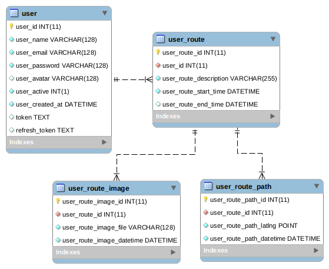

# tracker-api

This is a PHP REST API using JWT authentication.

The purpose of this API is to provide data to Tracker app, located at [TrackerApp](https://github.com/vipontes/tracker-app).

This is the database schema used by this API:



## Tips and Tricks

### Unit Test

```
./vendor/bin/phpunit ./tests/UserTest.php
```

### Create a local server on PHP

```
php -S 127.0.0.1:8080 -t public
```

### Autoload update command. Run it anytime you change _composer.json_

```
composer dump-autoload
```

## References

[Writing testable API apps in Slim framework](https://medium.com/@Andela/writing-testable-api-apps-in-slim-framework-29905970941b)

[Łukasz Zakrzewski](http://lzakrzewski.com/2016/02/integration-testing-with-slim/)
